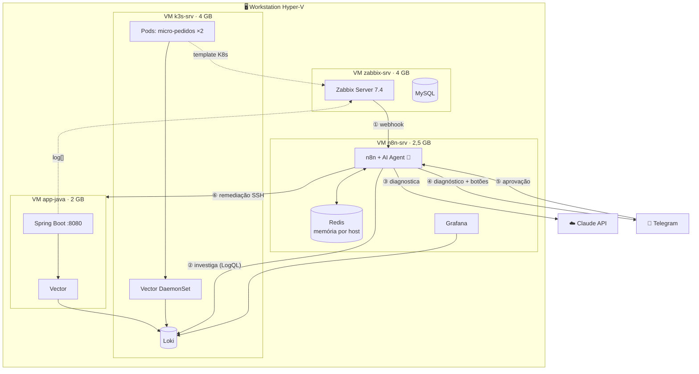
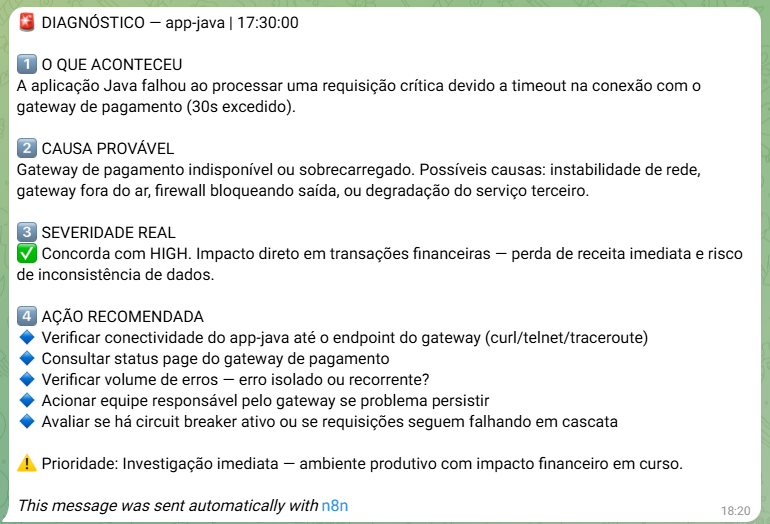
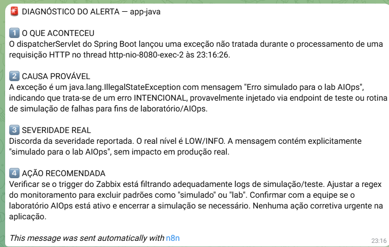
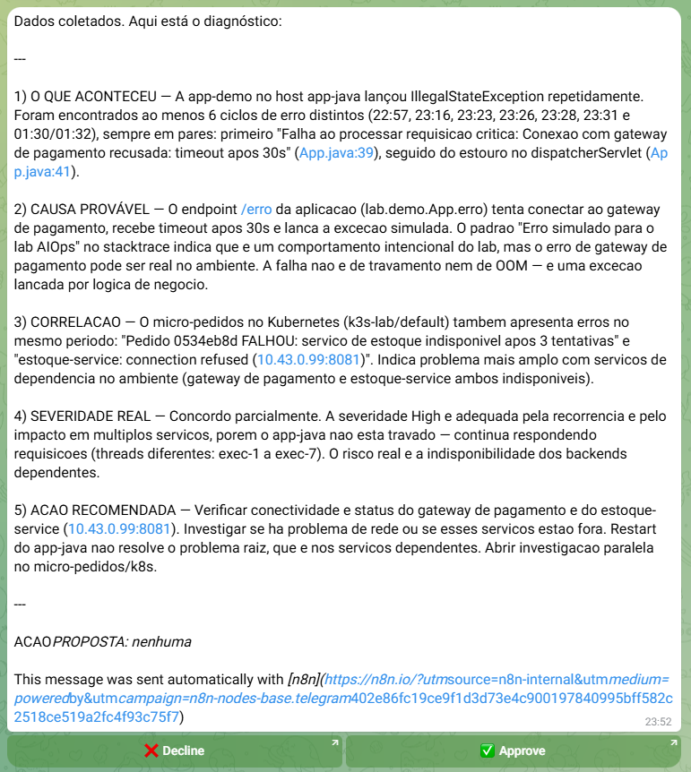
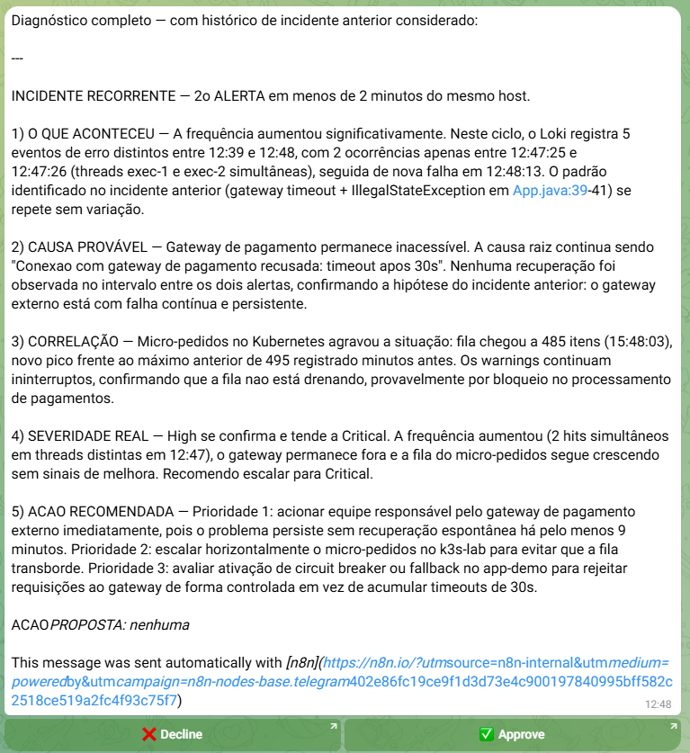
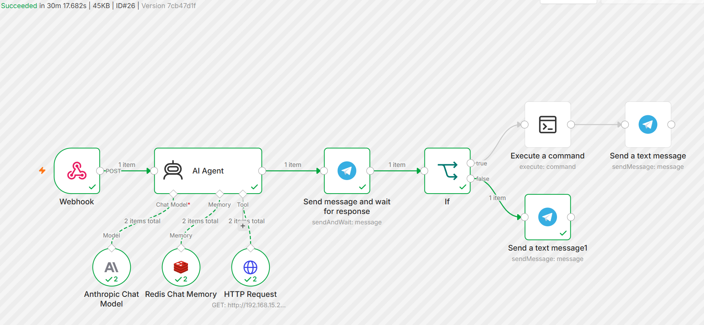

# 🤖 Lab AIOps — Plataforma de Operações Inteligentes

> Laboratório completo de AIOps construído do zero: detecção (Zabbix), logs centralizados (Vector + Loki), diagnóstico por IA agentica (n8n + Claude) e auto-remediação com aprovação humana (Telegram + SSH).

## 🎯 O que este projeto faz

Quando uma aplicação falha neste lab, em menos de 2 minutos:

1. **Zabbix detecta** o erro no log (ou métrica, ou estado de pod)
2. **n8n recebe** o alerta via webhook
3. **Um agente de IA investiga**: consulta os logs centralizados no Loki (escrevendo suas próprias queries LogQL), correlaciona com outros serviços e **lembra dos incidentes anteriores do host** (memória Redis) — reconhecendo recorrência e comparando com diagnósticos passados
4. **O diagnóstico chega no Telegram**: o que aconteceu, causa provável, severidade validada, ação recomendada — com evidências citadas dos logs
5. Se houver remediação aplicável, a IA **propõe a ação** e o Telegram exibe botões **✅ Aprovar / ❌ Rejeitar**
6. Aprovado, o n8n **executa via SSH** (com privilégios mínimos) e reporta o resultado

### Exemplo real de diagnóstico gerado

> *"O micro-pedidos no cluster k3s também apresenta erros no mesmo período: 'estoque-service: connection refused'. Indica problema mais amplo com serviços de dependência. **Restart do app-java não resolve o problema raiz** — ACAO_PROPOSTA: nenhuma"*

A IA sabe quando **não** agir. 🎓

## 🏗️ Arquitetura

Diagrama completo e versões anteriores em [`diagrams/`](diagrams/).

## 📦 Componentes

| Componente | Onde | Função |
|---|---|---|
| Zabbix 7.4 + MySQL | VM .200 | Detecção: métricas, log monitoring, template Kubernetes |
| Spring Boot (app-demo) | VM .201 | Aplicação-alvo com endpoints de caos (`/api/erro`, `/api/npe`) |
| k3s + micro-pedidos | VM .202 | Microserviço em pods (2 réplicas, probes, Traefik) com logs JSON |
| Loki | k3s | Armazenamento centralizado de logs |
| Vector | VM .201 + DaemonSet | Coleta (arquivo com multiline p/ stack traces; stdout dos pods) |
| n8n + AI Agent | VM .203 | Orquestração + agente investigativo (Claude via API) |
| Grafana | VM .203 | Exploração visual dos logs (datasource Loki) |
| Redis | VM .203 | Memória do agente por host (reconhecimento de recorrência) |
| Telegram Bot | — | Entrega de diagnósticos e aprovação human-in-the-loop |

## 📸 Evidências

A evolução do agente em quatro diagnósticos (galeria completa em [`prints/`](prints/)):

| | |
|---|---|
| **1. Diagnóstico simples** (Fase 6)  | **2. Triage cética** — rebaixa o erro "simulado"  |
| **3. Investigativo** — correlação via Loki + "restart não resolve a raiz"  | **4. Com memória** — reconhece recorrência e escala severidade  |

O pipeline por dentro:

## 📚 Documentação

- [Arquitetura e decisões](docs/01-arquitetura.md) — o desenho e os porquês
- [Fases de implementação](docs/02-fases.md) — o roteiro completo, fase a fase
- [Decisões de arquitetura (ADRs)](docs/03-decisoes.md) — trade-offs registrados
- [Troubleshooting — war stories](docs/04-troubleshooting.md) — kernel panic, OOM, e o pipeline de alertas dissecado
- [Segurança](docs/05-seguranca.md) — chaves, sudoers, tokens, least privilege
- [Como reproduzir](docs/06-como-reproduzir.md) — ordem de montagem
- [Roadmap](docs/07-roadmap.md) — Terraform/cloud, vector store de runbooks, Hermes

## 📦 Reprodutível

O workflow do n8n está disponível **sanitizado e pronto para importar**
([`n8n/zabbix-aiops.workflow.json`](n8n/zabbix-aiops.workflow.json)) — importe,
plugue suas credenciais e o pipeline roda no seu ambiente. Manifests, fontes
das aplicações e configs do Vector também estão completos no repositório.

## 🧠 O que este lab demonstra

- **IA agentica completa** — raciocínio (LLM) + ferramentas (LogQL próprio no Loki) + memória (Redis por host): investiga, correlaciona e reconhece recorrência comparando com diagnósticos anteriores
- **Human-in-the-loop**: automação com aprovação explícita antes de qualquer ação
- **Least privilege de ponta a ponta**: sudoers com allowlist de comandos, chaves por função, tokens com expiração
- **Observabilidade em camadas**: detector (Zabbix) separado da memória investigativa (Loki)
- **Kubernetes na prática**: deploy com réplicas, probes, ingress, RBAC, DaemonSet

## ⚠️ Avisos

- Lab de **estudo**: sem HA, sem TLS interno, secrets simplificados. Não usar como está em produção.
- Custos: API da Anthropic (~US$ 0,01-0,05 por diagnóstico investigativo).

## 📜 Licença

MIT
